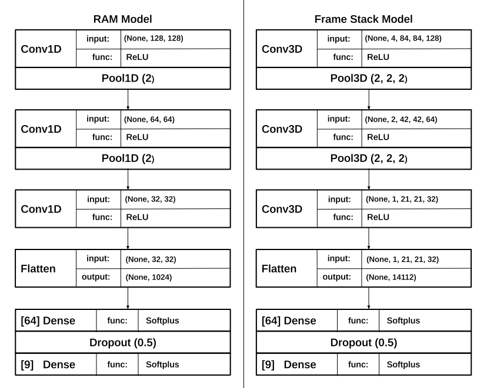

# Ms. Pacman Reinforcement Learning
Reinforcement Learning on the Atari 2600 game Ms. Pac-Man using a CNN with Tensorflow and OpenAI's gym environment.

Note: as a result of using the **keyboard** library, linux will require sudo permissions when launching and installing the dependencies. Make sure to run:

`sudo python3 MsPacman.py`

and 

`sudo pip3 install -r dependencies.txt`

---

