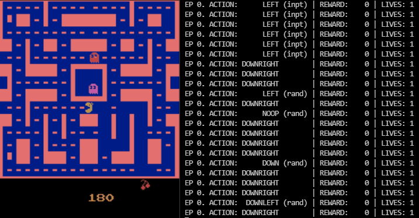

# Ms. Pacman Server/Client Reinforcement Learning
Reinforcement Learning on the Atari 2600 game Ms. Pac-Man using Q-Learning and a Convolutional Neural Network. Uses **[Tensorflow](https://www.tensorflow.org)** and OpenAI's **[Gym](https://gym.openai.com)** toolkit, which provides a wrapper for the **[ALE](https://github.com/mgbellemare/Arcade-Learning-Environment)** platform/emulator. This is combined with gRPC implementation that allows a remote client to control and play an instance of the emulator running on a separate server.

Note: this uses the **[keyboard](https://github.com/boppreh/keyboard)** library, which on linux requires root permissions for full functionality. When installing the dependencies and launching the program, be sure to run with sudo permissions. 

`sudo pip3 install -r requirements.txt && sudo python3 MsPacman.py`

Or just run `make install` and `make run` with the included Makefile.

---

---

